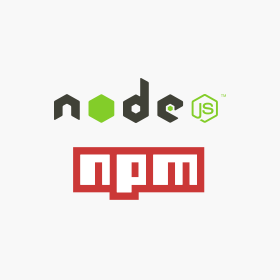

# Markdown Links

Extrae los links de tus directorios y/o archivos markdown (.md).

## Preámbulo

[Markdown](https://es.wikipedia.org/wiki/Markdown) es un lenguaje de marcado
ligero muy popular entre developers. 

Estos archivos normalmente contienen _links_.

Dentro de una comunidad de código abierto, nos han propuesto crear una
herramienta usando [Node.js](https://nodejs.org/), que lea y analice archivos
en formato `Markdown`, para verificar los links que contengan y reportar
algunas estadísticas.




 ## Cómo se instala?

Para usar esta biblioteca instala:

npm install @jocecasteletti/md-links --save


Ejemplo uso biblioteca
```javascript
const mdLinks = require('@jocecasteletti/md-links');

mdLinks('rutaalreadme/ejemplo.md')
  .then(data => {
    // Imprime arreglo de los objetos de los links
    data.forEach(link => {
      console.log(`href: ${link.href}, file: ${link.file}, text: ${link.text}`);
    });
  })
  .catch(error => {
    // Imprime error en el caso de por ejemplo, ruta inválida
    console.error(error);
  });
```


## Comando línea de interfaz

Ejemplo CLI
```
$ npm install @jocecasteletti/md-links --save
$ npx md-links ejemplo.md
```
El anterior comando da como resultado 
```
C:\rutaalarchivo\ejemplo.md https://github.com/workshopper/learnyounode learnyounode
C:\rutaalarchivo\ejemplo.md https://github.com/workshopper/how-to-npm how-to-npm
```


## Leer un directorio

```
C:\rutaalarchivo\SCL009-md-links> node .\src\md-links.js ./

```

El anterior comando da como resultado


```
C:\rutaalarchivo\SCL009-md-links\prueba.1.md https://github.com/workshopper/learnyounode learnyounode
```

### Dependencias:

* node.js versión v11.8.0
* chalk 2.4.2
* yargs 13.3.0
* jest: 24.8
* chalk: 2.4.2
* filehound: 1.17.0
* marked: 0.6.2


### Planificación

Puedes seleccionar [aquí](https://trello.com/b/vTQ9Thfe/md-links)
 para conocer la planificación realizada con la plataforma utilizó Trello.


Autor
Jocelyn Casteletti, 9na generación, Laboratoria.

